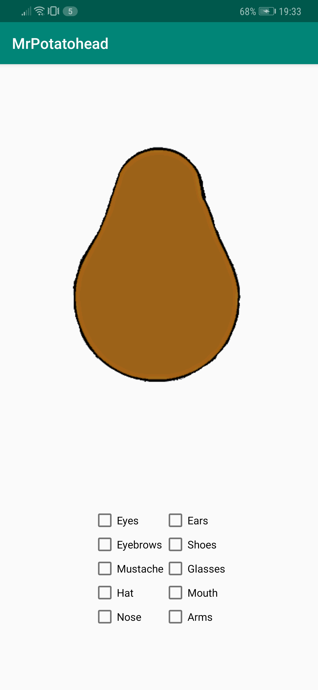
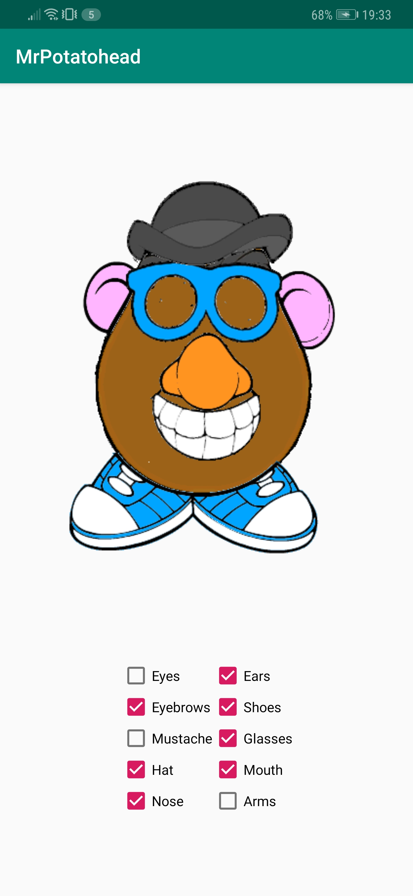
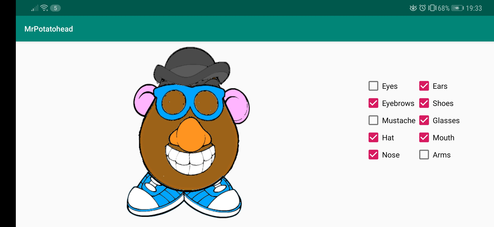

# MrPotatohead
A short description of the app MrPotatohead.

## Getting Started
### Prerequisites
The app is created in Android-Studio, it is currently made for API 24 Nougat (Android 7.0), but also confirmed running on API 28 Pie (Android 9.0).
An android phone with either one of those Android versions (and most likely the versions in between) will suffice.

### Testing
When launching the app, a screen appears showing an empty potato with numerous checkboxes below it.

Now a user can start checking the checkboxes, each time a checkbox is checked a new part of Mr. Potatohead will become visible.

This app can also be used in landscape mode, while keeping the checkboxes checked and the body parts visible.

## Author
* Me

## Acknowledgements
* Renske Talsma
* Natasja Wezel
